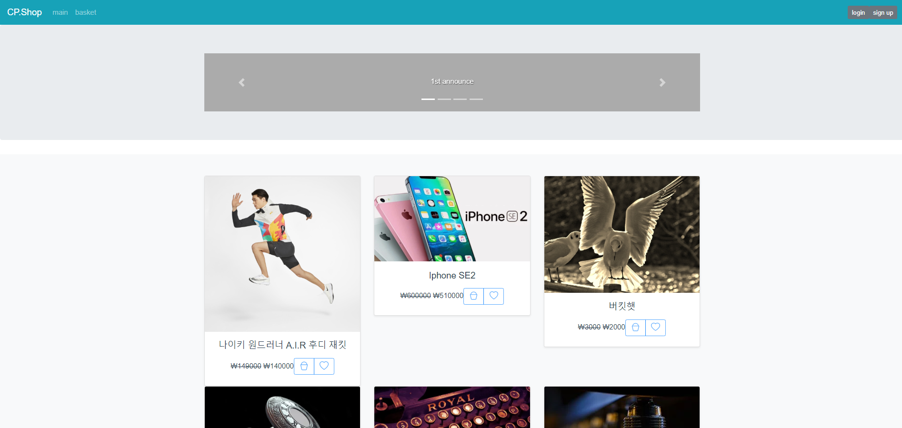

# Vue-cli-crudPjt

이 프로젝트는 shop-rest-jpa-pjt 를 백엔드 서버로서 사용합니다.
백엔드 서버 프로젝트 주소 link : [shop-rest-jpa-pjt](https://github.com/AllenChoiwonwoo/shop-rest-jpa-pjt.git)

this CP.Shop Vue pjt(front) work with "shop-rest-jpa-pjt"(back)
here is ther link : [shop-rest-jpa-pjt](https://github.com/AllenChoiwonwoo/shop-rest-jpa-pjt.git)

## 메인페이지
 - BaseUrl : http://localhost:8081/

# 프로젝트 소개
간단한 쇼핑몰입니다.

 **기능**
 1. 로그인
 2. 회원가입
 3. 메인페이지(상품리스트 페이지)
 4. 상품상세페이지
 5. 장바구니(회원전용)
 6. ~~결제페이지 ( 작성중 )~~

## 제작 정보
vue-router 템플릿을 기반으로 만든 간단한 쇼핑몰 사이트 입니다.
CodePresso 의  Dev-ops 과정을 수강하면 개발한 학습용 프로젝트 입니다.

## 사용기술
 - HTML/CSS
 - Bootstrap Vue
 - Vue.js  :  @vue/cli 4.2.3
 - Node.js : v12.16.1.

## Dependencies

 - Axios
 - Bootstrap
 - Bootstrap-Vue
 - core-js
 - vue
 - vue-cookies
 - vue-router

  
  ## 저작권
  [codepresso](codepresso.kr)
  